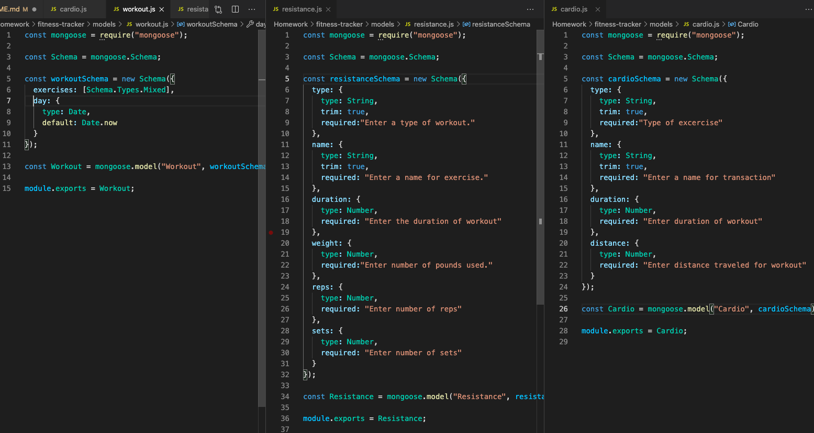

# fitness-tracker

## Links
Link to deployed application [Heroku Link](https://infinite-citadel-09071.herokuapp.com/?id=60a958f300df780015c89196)

## Summary
An app that let's the user view, create, and track daily workouts. My task was to create the back-end portion of this application by using a Mongo database with a Mongoose schema and handle routes with Express. The Fitness tracker is deployed to and hosted on Heroku. 

## Table of Contents
1. [Usage](#usage)
2. [SetUp](#setup)
3. [What I Learned](#what-i-learned)
4. [Resources](#resources)

## Usage
Upon opening the app a user is sent to the homepage which will display the users last workout. From there the users can choose to "Contine Workout" or create a "New Workout."  

If a user decides to contiue their workout they are brought to the exericse api where they will choose which type of workout they wish to continue either Cardio or Resistance. From there the user fills out the form and can then decide whether to complete the exercise or add another exercise. If the user chooses to complete an excerise they are then redirected back to the homepage if they choose to add another exercise a message is displayed letting the user know their workout was added and the form resets. 

The New Workout page is similar to the continue exercise page. The user will choose either a cardio or resistance workout and fill out the form, once done they can decide to complete the workout or add another exercise. After completeing the workout the user is once again taken back the to landing page. 

The most complicated part of the application was getting the stats api route to work. In the stats page the user can view two graphs. The first graph shows them the total duration of their workout per day for the last seven days. The second graph is a bar graph that shows the combined weight in pounds used in the workout per day for the last 7 days. Clicking "Fitness Tracker" in the nav bar will take the user back to the loading page.  

## Setup
The back-end portion of this application is set up using a Mongo database with Mongoose schemas. The different routes are handled with Express. First the server was set up using the basic structure we practiced during the week. 

Once the server was set up the models were created which are the Mongoose schemas. Three models were made: Cardio, Resistance, and workout. Cardio and Resistance are the two types of exercises based off the front end and the models were made using information from the seeds file to set up the specific attributes per exercise type. The Workout model is two things: a date, and an array of whatever exercise was selected. 

After the models were finished the routes were created. The API routes were created first based off of the information in the front-end files. The api.js file contains methods for all the functions executed in worout.js, stats.js, and exercise.js from the public folder. A db.js file was also added to the front-end portion of the file structure incorporating what we learned about IndexDB. 

## What I Learned
The routes were the most difficult part of this project for me. The models and the db.js file were easy enough to follow along with, but getting the routes to diplay the information and run the front end code took multiple hours to figure out. The MongoDB aggregate functions was used to get the total duration time of a workout and getting that to dispaly on the homepage wasn't too much trouble, but getting to total time to plot on the graph was difficult as another aggregate function was needed. 

A homeroutes file was created to feed the html pages through the routes to display the information properly for both the stats page and the exercise page where you add or update a workout. Another roadblock I ran into was that the .update method is deprecated and I spent a long time trying to find a more recent version, but ultimaly just went with what was taught in class and the method worked. 

## Resources
* [Mongo Aggregation](https://docs.mongodb.com/manual/aggregation/)
* [Mongo $Sum](https://docs.mongodb.com/manual/reference/operator/aggregation/sum/)
* [Mongo Aggregation Pipeline](https://docs.mongodb.com/manual/meta/aggregation-quick-reference/#std-label-aggregation-expressions)
* [Mongoose](https://mongoosejs.com/docs/2.7.x/docs/updating-documents.html) 
* [Mongo $Add](https://docs.mongodb.com/manual/reference/operator/aggregation/addFields/) 